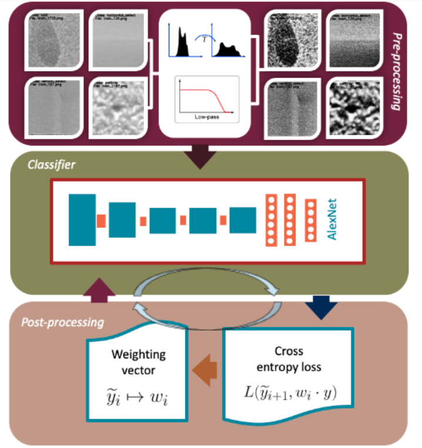
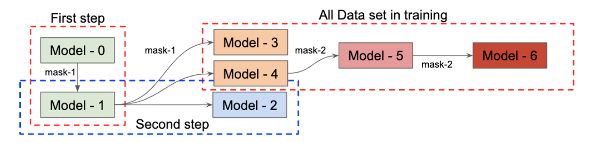
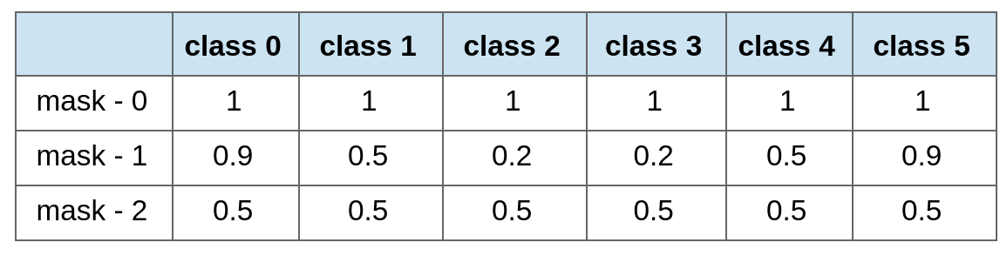
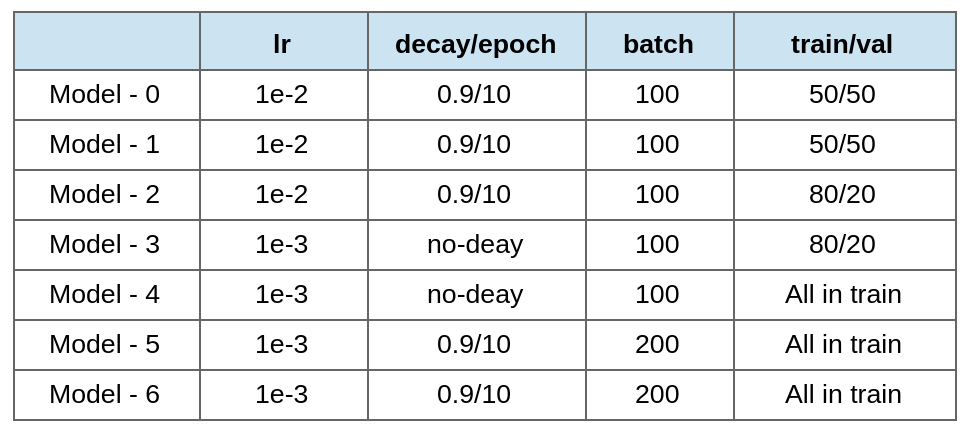
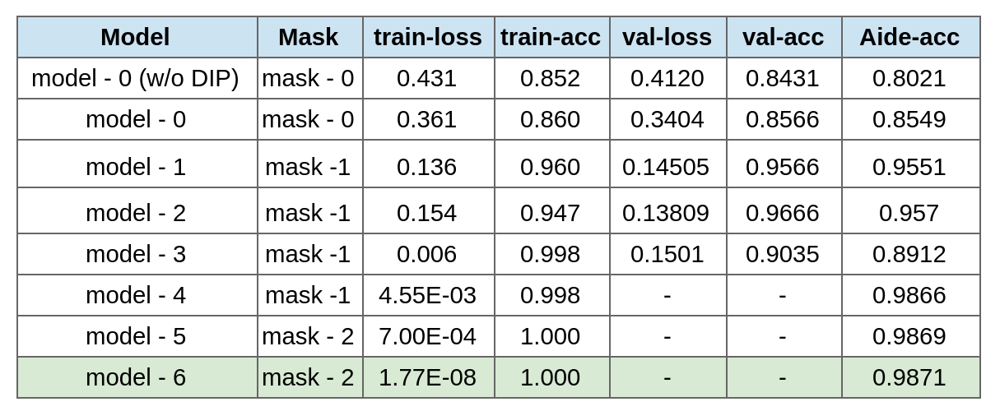
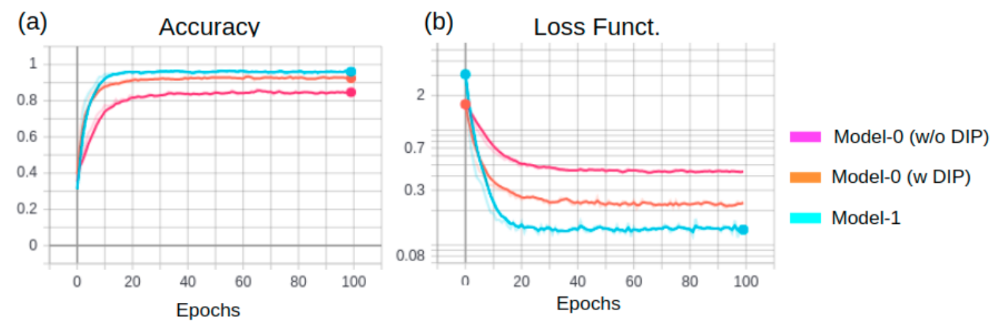
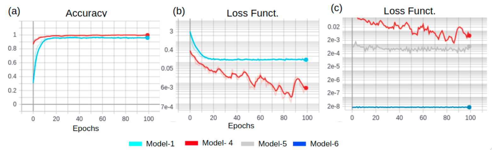

# A Weithing Loss Function for multi-class classification

The method described for this project aims to solve a multi-class classification problem, in particular,
to AIO defects with limited dataset and a simple CNN architecture. This method consists of three independent stages: pre-processing data,
classification, and last but not least post-processing data. 
The pre-possessing stage aims to enhance every image such that the most salient features are boosted. 
Indeed we show that using the pre-processing strategy increases the performance of our model by about 15%.
Our classifier is the convolution neural model (CNN) AlexNet.
We chose this architecture to prove that our strategy can increase the accuracy of a model,
without using more data nor deeper architectures as well.  
Lastly, the post-processing stage evaluates the mentioned classifier up to every class, .i.e., the probability estimation per class. 
Based on this class evaluation, a weighting vector is manually designed to redefine our cross-entropy function, 
then, we retrain our classifier again. Details of the proposed method are illustrated in bellow.
Note that in the post-processing stage, a repeating cycle is generated, where a model is trained, 
and then after to evaluate a weight vector, it is restrained again.

## Figure 1. Teaser. 
In this figure, the three main stages of our model are illustrated: pre-processing, classification, post-processing. Note that the post-processing stage defines multiple cycles, wherein our classifier is trained based on the preprocessed dataset, and then based on a hand-made weighting vector it is re-trained again. A weighting vector w is defined at every cycle after a model is trained. These weitghting vectors are listed in [table 2](#table-1-weighting-vector---mask)

## Figure 2. Training pipeline

This flowchart illustrates the training process, from model-0 until our final model-6. Note that in the training process different settings in our dataset as well as weighting vectors (masks) were used. For further detail please refer to [table 1](#table-1-weighting-vector---mask) and [table 2](#table-2-hyperameter-for-training).

## Table 1. Weighting Vector - mask

## Table 2. Hyperameter for training

## Table 3. Models' performance
 Note that the last column is the accuracy reached by the evaluation in the Aidea website.

## Figure 3. Comparison 1
Note that the purple evaluation describes the accuracy (a) and loss function evaluation (b) for the model-0 without using the pre-processing stage described in [figure 1](#figure-1-teaser). Moreover, the cyan evaluation shows how effective our weighting strategy is by further reducing the loss evaluation (b) and increasing the accuracy (a). The orange line represent the evaluation of the model-0 by using a pre-processing stage (Image enhancement) 

## Figure 4. Comparison 2
Note that in panel (a) and (b) a comparison between model-1 and model-4 is presented.  Consider that the model-4 (red line) is re-trained from model-1 by using the mask-1 described in [Table 1](#table-1-weighting-vector---mask). In panel (c) a comparison between model-4, model-5, and model-6 are illustrated. Note that those latter were trained by using the mask-2 in [Table 1](#table-1-weighting-vector---mask). 

